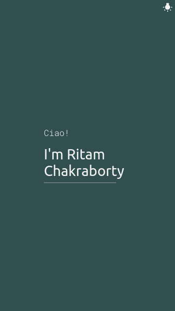

# Intro
A simple introduction website build using **NodeJS**

The word **Hello** changes to 107 different languages every second.

### Demo
**Light Theme**

    
    

**Dark Theme**

    
    

 

Checkout the project hosted in [Glitch](https://glitch.com), [here](https://intro-ritam.glitch.me/).

### Credit
[NodeJS Crash Course](https://www.youtube.com/watch?v=fBNz5xF-Kx4) 
by [Traversy Media](https://www.youtube.com/user/TechGuyWeb) helped me to learn the fundamental of _NodeJS_.
